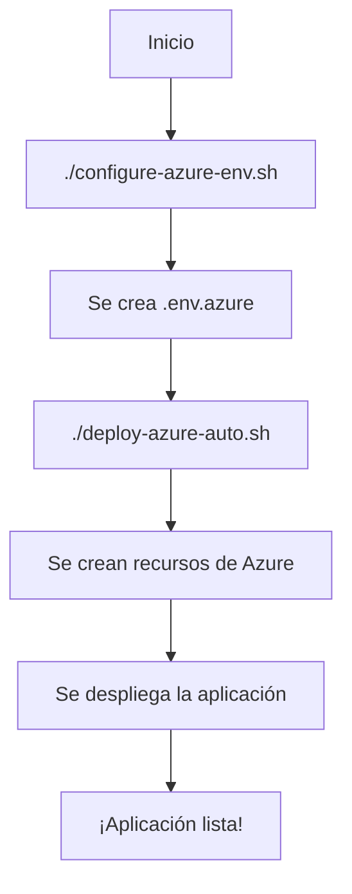

# 📋 Guía Rápida: Despliegue de Educational System en Azure Container Apps

## 🚀 Despliegue Automático con Variables de Entorno

### 📁 Archivos Creados
- ✅ `.env.azure.template` - Plantilla de variables de entorno
- ✅ `.env.azure` - Configuración real (se creará dinámicamente)
- ✅ `configure-azure-env.sh` - Script interactivo de configuración
- ✅ `deploy-azure-auto.sh` - Script de despliegue automático
- ✅ `apply-env-config.sh` - Script para aplicar configuración a Azure

## 🔧 Instrucciones de Uso

### Paso 1: Configurar Variables de Entorno
```bash
# Hacer ejecutable el script de configuración
chmod +x configure-azure-env.sh

# Ejecutar configuración interactiva
./configure-azure-env.sh
```

Este script te pedirá:
- ✅ Grupo de recursos y ubicación de Azure
- ✅ Tus claves de API (Groq, OpenAI, etc.)
- ✅ Generará contraseñas seguras automáticamente
- ✅ Creará el archivo `.env.azure` con toda la configuración

### Paso 2: Desplegar a Azure
```bash
# Hacer ejecutable el script de despliegue
chmod +x deploy-azure-auto.sh

# Ejecutar despliegue completo
./deploy-azure-auto.sh
```

### 📋 Flujo Completo del Despliegue



## 🎯 ¿Dónde van las Variables de Entorno?

### 1. **Archivo `.env.azure`** (local)
- ✅ Contiene todas las variables de entorno
- ✅ No se sube a Git (está en .gitignore)
- ✅ Se usa durante el despliegue

### 2. **Azure Container Apps Secrets**
- ✅ Las contraseñas y claves sensibles se almacenan como secrets
- ✅ Variables como `GROQ_API_KEY`, `OPENAI_API_KEY` se almacenan seguras
- ✅ Las URLs de conexión se generan dinámicamente

### 3. **Variables Directas**
- ✅ Variables no sensibles como `ENVIRONMENT=production`
- ✅ Configuración de puertos y workers

## 📊 Variables de Entorno Principales

### 🔑 Claves de API (Requeridas)
```bash
GROQ_API_KEY=tu-clave-groq-aqui
OPENAI_API_KEY=tu-clave-openai-aqui
ANTHROPIC_API_KEY=tu-clave-anthropic-aqui
```

### 📊 Base de Datos
```bash
POSTGRES_PASSWORD=contraseña-generada-automaticamente
POSTGRES_DB=educational_system
POSTGRES_USER=admin
```

### 🔄 Servicios de Soporte
```bash
REDIS_PASSWORD=contraseña-redis
RABBITMQ_PASSWORD=contraseña-rabbitmq
```

## 🎛️ Comandos Útiles Post-Despliegue

### Verificar Estado
```bash
# Ver URL de la aplicación
az containerapp show --name educational-api --resource-group educational-system-rg --query properties.configuration.ingress.fqdn

# Ver logs en tiempo real
az containerapp logs show --name educational-api --resource-group educational-system-rg --follow

# Verificar health check
curl https://tu-url.azurecontainerapps.io/health
```

### Escalar la Aplicación
```bash
# Escalar manualmente
az containerapp update --name educational-api --resource-group educational-system-rg --min-replicas 5 --max-replicas 20

# Ver métricas
az monitor metrics list --resource educational-api --resource-group educational-system-rg --resource-type Microsoft.App/containerApps
```

## 🚨 Solución de Problemas

### Error: "Azure CLI no está instalado"
```bash
# Instalar Azure CLI
curl -sL https://aka.ms/InstallAzureCLIDeb | sudo bash

# Verificar instalación
az --version
```

### Error: "Docker no está instalado"
```bash
# Instalar Docker
# Ubuntu/Debian:
sudo apt-get update
sudo apt-get install docker.io

# macOS:
# Descargar desde https://docs.docker.com/desktop/mac/install/
```

### Error: ".env.azure no encontrado"
```bash
# Ejecutar configuración interactiva
./configure-azure-env.sh
```

## 📊 Costo Estimado

| Recurso | Costo Mensual |
|---------|---------------|
| Container Apps (Básico) | $15-30 |
| PostgreSQL | $10-20 |
| Redis | $5-10 |
| Container Registry | $5 |
| **Total Estimado** | **$35-65/mes** |

## 🔄 Actualizar Configuración

Si necesitas cambiar alguna variable después del despliegue:

```bash
# 1. Editar .env.azure
nano .env.azure

# 2. Recargar configuración
./apply-env-config.sh

# 3. Reiniciar la aplicación
az containerapp restart --name educational-api --resource-group educational-system-rg
```

## 🎉 Verificación Final

Después del despliegue exitoso, deberías ver:
- ✅ URL de la aplicación: `https://[nombre-unico].azurecontainerapps.io`
- ✅ Health check: `https://[url]/health`
- ✅ Documentación API: `https://[url]/docs`
- ✅ Todos los servicios corriendo (PostgreSQL, Redis, RabbitMQ)

## 🆘 Apoyo

Si tienes problemas:
1. Verifica que Azure CLI esté instalado: `az --version`
2. Asegúrate de estar logueado: `az account show`
3. Revisa los logs: `az containerapp logs show --name educational-api --resource-group educational-system-rg --follow`
4. Verifica el archivo .env.azure contiene todas las variables necesarias

## 🚀 ¡Listo para Desplegar!

Ahora solo necesitas ejecutar:
```bash
./configure-azure-env.sh    # Configura tus variables
./deploy-azure-auto.sh      # Despliega todo a Azure
```

¡Tu aplicación estará en línea en 5-10 minutos!